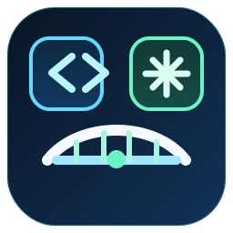

# Codex Bridge

[](https://github.com/pesoszpesosz/codex-bridge-vscode-api/actions/workflows/ci.yml)
[](./LICENSE)

<p align="center">
  
</p>

Codex Bridge is a local HTTP API for VS Code Codex automation. It runs as a VS Code extension and exposes the installed OpenAI ChatGPT/Codex extension through a stable, scriptable loopback API that external tools can call.

If you want to start Codex tasks from another app, continue an existing Codex conversation, monitor worker status, and keep those conversations visible in the VS Code Codex history sidebar, this repo is for that.

## Why This Exists

The Codex UI inside VS Code is useful for interactive work, but automation needs a programmable interface:

- a way to create a new Codex conversation without typing manually
- a way to resume a known conversation by id
- a way to detect whether the worker is starting, running, completed, or failed
- a way to let another process trigger Codex work as part of a larger pipeline

Codex Bridge adds that missing API layer locally on the same machine where VS Code is running.

## What It Does

- Starts a brand new Codex conversation with an initial task prompt
- Continues an existing Codex conversation by `conversationId`
- Opens or focuses the matching Codex tab in VS Code
- Tracks each dispatched run as a job with lifecycle state and timestamps
- Creates new bridge conversations as `vscode` threads so they appear in the Codex history sidebar
- Upgrades older legacy bridge conversations into history-visible threads when they are continued

## Who This Is For

- developers building local automation around Codex in VS Code
- tool builders who want a lightweight local Codex API
- people creating feedback loops, worker queues, or orchestration systems around Codex
- teams that want VS Code Codex chat automation without manually driving the UI

## Key Terms

- `conversation`: a Codex thread in the VS Code ChatGPT/Codex extension
- `job`: one dispatched worker run tracked by the bridge
- `history-visible thread`: a conversation created through the Codex app-server as a `vscode` source thread, which appears in the Codex history sidebar

## Features

- Local HTTP API on `127.0.0.1:8765` by default
- Pollable job lifecycle: `starting`, `running`, `completed`, `failed`
- Conversation discovery endpoints for current and open tabs
- Auth token support for non-default local deployments
- OpenAPI spec for downstream integrations
- GitHub Actions CI
- Zero external runtime dependencies in the extension itself

## Requirements

- VS Code 1.90 or newer
- OpenAI ChatGPT extension installed in VS Code
- Codex access available in that extension
- Node.js 22 or newer for local validation and packaging

## How It Works

Codex Bridge runs inside VS Code as an extension. When a client sends an HTTP request:

1. the bridge receives the request on the local HTTP server
2. it starts or resumes a Codex thread using the bundled Codex app-server when possible
3. it starts a turn with the provided message
4. it tracks notifications from the Codex worker and updates an in-memory job record
5. it tries to reveal the matching conversation tab in VS Code
6. it exposes the result through `/jobs` and the conversation endpoints

The preferred path uses the Codex app-server because that creates `vscode` source threads, which is what makes bridge-created conversations show up in the Codex history sidebar.

Some advanced request options are not available through the app-server transport yet. For those, the bridge falls back to the CLI `exec` path. Those fallback runs may not appear in the history sidebar because they are created as `exec` source threads instead.

More detail is in [docs/ARCHITECTURE.md](./docs/ARCHITECTURE.md).

## API Overview

Base URL:

```text
http://127.0.0.1:8765
```

Endpoints:

- `GET /health`
- `GET /jobs`
- `GET /jobs/:jobId`
- `GET /conversations/open`
- `GET /conversations/current`
- `POST /conversations`
- `POST /conversations/current/messages`
- `POST /conversations/:conversationId/messages`

Reference docs:

- machine-readable spec: [openapi.json](./openapi.json)
- endpoint guide: [docs/API.md](./docs/API.md)
- troubleshooting: [docs/FAQ.md](./docs/FAQ.md)

## OpenClaw and Codex Skill

This repo now includes an installable skill bundle in [skills/codex-bridge-api](./skills/codex-bridge-api). It is meant for OpenClaw, Codex, and other agents that consume the standard `SKILL.md` plus `agents/openai.yaml` format.

The skill gives an agent a direct, repeatable workflow for:

- checking whether the local bridge is running
- starting a new VS Code Codex task
- continuing an existing conversation by id
- polling a job until the worker finishes

Install it with the open skills CLI:

```bash
npx skills add pesoszpesosz/codex-bridge-vscode-api --skill codex-bridge-api -a openclaw
```

Install it for Codex with:

```bash
npx skills add pesoszpesosz/codex-bridge-vscode-api --skill codex-bridge-api -a codex
```

The bundled helper script is [bridge_client.py](./skills/codex-bridge-api/scripts/bridge_client.py).

## Quick Start

1. Clone this repository.
2. Open it in VS Code.
3. Launch an Extension Development Host with `F5`, or package/install the extension as a VSIX.
4. Confirm the bridge is running:

```bash
curl http://127.0.0.1:8765/health
```

The bridge auto-starts by default.

## Example: Start a New Codex Worker Task

```bash
curl -X POST http://127.0.0.1:8765/conversations \
  -H "Content-Type: application/json" \
  -d "{\"message\":\"Inspect this repo and fix the failing tests\",\"cwd\":\"C:\\\\path\\\\to\\\\repo\",\"approvalPolicy\":\"never\",\"sandbox\":\"danger-full-access\"}"
```

This starts a new Codex conversation, dispatches the first task, returns a `conversationId`, and includes a `job` plus `jobUrl` so your automation can poll for completion.

## Example: Continue an Existing Codex Conversation

```bash
curl -X POST http://127.0.0.1:8765/conversations/CONVERSATION_ID/messages \
  -H "Content-Type: application/json" \
  -d "{\"message\":\"Continue and finish the implementation\",\"ensureOpen\":true}"
```

If the requested conversation was an older legacy `exec` conversation, the bridge upgrades it into a history-visible `vscode` thread and returns both the requested id and the upgraded id.

## Example: Poll Job Status

```bash
curl http://127.0.0.1:8765/jobs/JOB_ID
```

Job records include:

- lifecycle status
- timestamps
- `conversationId`
- open/focus status
- event counts
- last event type
- exit details
- failure information

## Common Request Fields

The request body can include:

- `message`
- `cwd`
- `approvalPolicy`
- `sandbox`
- `dangerouslyBypassApprovalsAndSandbox`
- `model`
- `serviceTier`
- `baseInstructions`
- `developerInstructions`
- `personality`
- `config`
- `images`
- `sendTimeoutMs`
- `openTimeoutMs`
- `outputSchemaPath`
- `outputLastMessagePath`
- `ensureOpen`
- `upgradeLegacyExecConversations`

Recommended settings for fully automated local runs:

- `approvalPolicy: "never"`
- `sandbox: "danger-full-access"`

## History Sidebar Behavior

New bridge-created conversations are started through the Codex app-server, which records them as `vscode` source threads. That is what makes them visible in the Codex history sidebar.

Older bridge-created conversations that were started through the legacy CLI `exec` path remain `exec` source threads. When you continue one through the bridge, it is automatically upgraded into a new history-visible `vscode` thread unless you explicitly disable that behavior.

## Security

This API is local by design.

- The default bind address is loopback only: `127.0.0.1`
- Optional bearer token support is available through `codexBridge.authToken`
- If you bind to anything other than loopback, set an auth token
- `danger-full-access` should only be used on trusted machines and trusted tasks

If `codexBridge.authToken` is configured, clients must send one of:

- `Authorization: Bearer <token>`
- `X-Codex-Bridge-Token: <token>`

## VS Code Commands

- `Codex Bridge: Start Server`
- `Codex Bridge: Stop Server`
- `Codex Bridge: Show Status`

## Repository Structure

- [extension.js](./extension.js): bridge implementation
- [openapi.json](./openapi.json): OpenAPI contract
- [smoke-test.js](./smoke-test.js): mocked smoke suite
- [docs/API.md](./docs/API.md): endpoint and payload guide
- [docs/ARCHITECTURE.md](./docs/ARCHITECTURE.md): system internals
- [docs/FAQ.md](./docs/FAQ.md): troubleshooting and common questions

## Development

Run local validation:

```bash
npm test
```

That runs:

- `node --check extension.js`
- `node smoke-test.js`

CI is defined in [.github/workflows/ci.yml](./.github/workflows/ci.yml).

Contribution guidance is in [CONTRIBUTING.md](./CONTRIBUTING.md).

## Publishing

This repo is ready to publish to GitHub.

If you want to publish the extension to the VS Code Marketplace, change the `publisher` field in [package.json](./package.json) to your publisher id before packaging or publishing.

## Limitations

- This depends on internal behavior of the installed OpenAI ChatGPT/Codex extension. It is not an official stable OpenAI API.
- If the ChatGPT/Codex extension changes its internal app-server behavior, bundled CLI layout, or conversation URI format, this bridge may need updates.
- Continuing an existing conversation still requires its `conversationId`.
